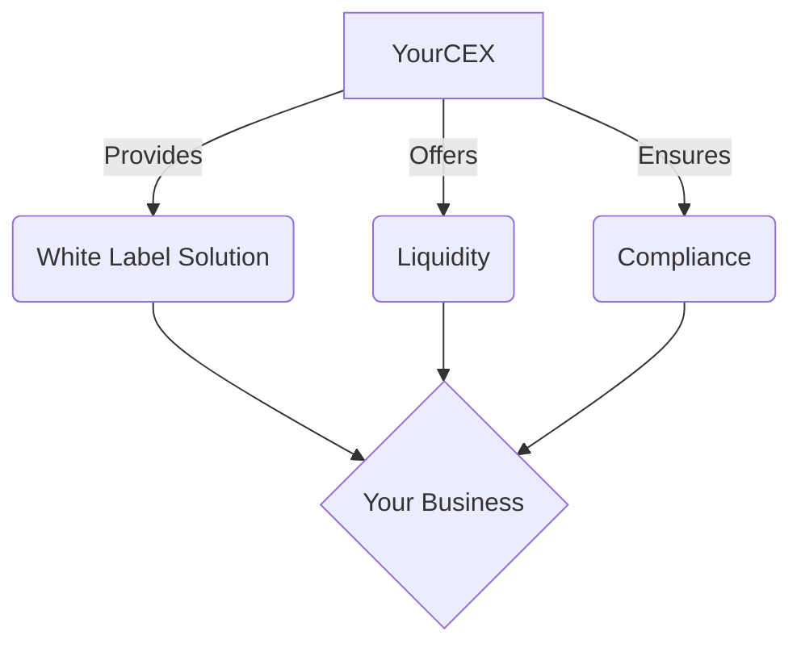

# Feature Showcase

This page demonstrates some of the features and capabilities of VitePress.

## Interactive Components

VitePress allows you to create interactive components using Vue.js. Here's a simple counter:

<script setup>
import { ref } from 'vue'

const count = ref(0)
</script>

<div class="counter-container">
  <p>Count: {{ count }}</p>
  <button @click="count++">Increment</button>
</div>

<style>
.counter-container {
  display: flex;
  flex-direction: column;
  align-items: center;
  margin: 2rem 0;
}
.counter-container button {
  margin-top: 1rem;
  padding: 0.5rem 1rem;
  font-size: 1rem;
  background-color: var(--vp-c-brand);
  color: white;
  border: none;
  border-radius: 4px;
  cursor: pointer;
  transition: background-color 0.3s;
}
.counter-container button:hover {
  background-color: var(--vp-c-brand-dark);
}
</style>

## Custom Containers

VitePress supports custom containers for highlighting content:

::: info
This is an info box.
:::

::: tip
This is a tip.
:::

::: warning
This is a warning.
:::

::: danger
This is a dangerous warning.
:::

::: details
This is a details block.
:::

## Code Blocks with Syntax Highlighting

VitePress supports syntax highlighting for code blocks:

```javascript
function greet(name) {
  console.log(`Hello, ${name}!`);
}

greet('YourCEX Partner');
```

## Tables

| Feature | Description |
|---------|-------------|
| White Label | Launch your own branded exchange |
| Liquidity | Access deep liquidity pools |
| Compliance | Benefit from our regulatory expertise |

## Emoji Support

VitePress supports emoji shortcodes: :rocket: :money_with_wings: :chart_with_upwards_trend:

## LaTeX Math Equations

VitePress can render LaTeX math equations:

Inline math: $e^{i\pi} + 1 = 0$

Block math:

$$
\frac{n!}{k!(n-k)!} = \binom{n}{k}
$$

## Diagrams with Mermaid

VitePress supports Mermaid diagrams:



These features showcase some of the capabilities of VitePress, allowing you to create rich, interactive documentation and web pages.